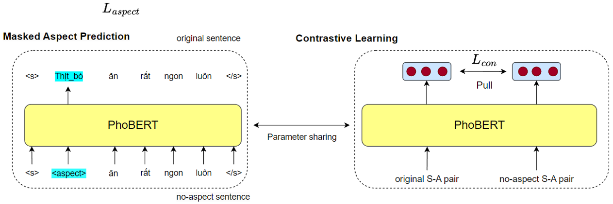
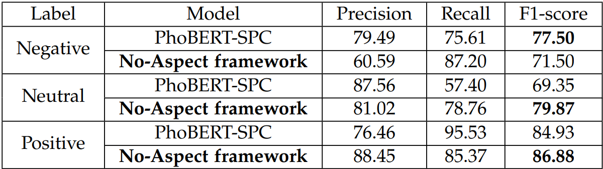

# Does Aspect affect Sentiment Polarity ?
Using special character \<aspect\> to replace aspect and build a No-aspect framework to eliminate sentiment bias.
## Overview
* Use Text Normalization, Tone Standardization and Word Segmentation for data preprocessing.

* Build a custom Constrastive Learning module to learn patterns between sentences.

* Build a custom Masked Aspect Prediction module to maintain semantic information of the sentence.

* Compare performance between Original model and No-aspect framework.

| Input | Output |
| ------------- |:-------------:|
| Mì ý ở đây ngon lắm, không chê vào đâu đươc í - Không gian cực kì dễ thương =)) thíc hợp với việc hẹn hò haha - Giá cả gọi là hợp lí cho sinh viên tụi mình lâu lâu tự thưởng cho bản thân một bữa ngon lành cũng không gọi là tiếc nuối đâu ạ | {Mì ý, Positive}, {Không gian, Positive}, {Giá cả, Positive}| 

## Dataset

| Set | Comment | Number of Aspect | Average aspects per comment | Average length per comment | Positive | Neutral | Negative |
| ------------- |:-------------:| :-------------: | :-------------: |  :-------------: |:-------------:| :-------------: | :-------------: | 
| Train | 3288 | 14688 | 4.47 | 53.72 | 8860 | 4480 | 1084 |
| Dev | 822 | 3685 | 4.48 | 54.2 | 2265 | 1077 | 257 |
| Test | 300 | 2644 | 8.8 | 109.47 | 1394 | 1031 | 189 |

## Experiments
## Compare with different baselines

| Model | Precision | Recall | F1-score |
|:-------------| :-------------: | :-------------: |  :-------------: |
|BiLSTM-IAN | 51.24 | 44.83 | 44.65 |
|BiLSTM-ATT | 56.65 | 49.56 | 50.94 |
|BERT-Multilingual SPC | 73.64 | 64.79 | 67.91 |
|**BERT-multilingual + NA Framework** | 68.89 | 70.04 | **69.21** |
|PhoBERT-SPC | 81.02 | 76.42 | 77.16 |
|**PhoBERT-SPC + NA Framework** | 76.69 | 83.77 | **79.42** |

##  Detailed results between sentiment polarity

## Experimental results of ablation study
| | Precision | Recall | F1-score |
|:-------------| :-------------: | :-------------: |  :-------------: |
| NA Framework | 76.69 | 83.77 | **79.42** |
| NA w/o CL | 79.64 | 75.22 | 76.16 |
| NA w/o MAP | 77.55 | 76.41 | 76.26 |
